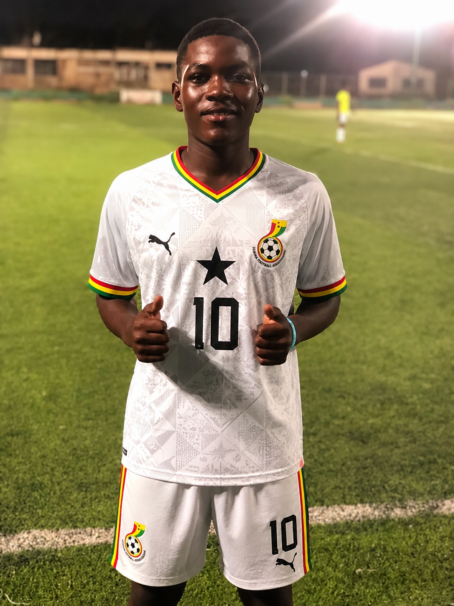

<!DOCTYPE html>
<html lang="en">
<head>
<meta charset="UTF-8">
<meta name="viewport" content="width=device-width, initial-scale=1.0">
<title>Kelvin Boakye | Football Portfolio</title>
<link rel="stylesheet" href="style.css">
<link href="https://fonts.googleapis.com/css2?family=Poppins:wght@300;500;700&display=swap" rel="stylesheet">
</head>

<body>

<header>

<nav>

<h2>Kelvin Boakye</h2>

<ul>
<li><a href="#home">Home</a></li>
<li><a href="#about">About</a></li>
<li><a href="#journey">Journey</a></li>
<li><a href="#achievements">Achievements</a></li>
<li><a href="#gallery">Gallery</a></li>
<li><a href="#videos">Highlights</a></li>
<li><a href="#contact">Contact</a></li>
</ul>

</nav>

</header>

<section id="home" class="hero">

<h1>Kelvin Boakye</h1>

<h3>Jnr Gattüsø</h3>

Defensive Midfielder | Central Midfielder | Right Back

<a href="#about" class="btn">Explore My Journey</a>

</section>

<section id="about">

<h2>About Me</h2>

I am Kelvin Boakye, also known as Jnr Gattüsø, a young Ghanaian footballer currently playing for Fergalina FC.

I am a hardworking and talented midfielder with excellent passing ability, vision and ball control.

I am committed to improving my technical skills, tactical awareness and physical fitness every day so I can reach the highest level of football.

<h3>Nationality</h3>

🇬🇭 Ghana

<h3>Current Club</h3>

Fergalina FC

<h3>Positions</h3>

DM | CM | RB

<h3>Height</h3>

135 cm

<h3>Weight</h3>

50 kg

</section>

<section id="journey">

<h2>Football Journey</h2>

My football journey began through local football in Accra, where I developed my passion for the game.

Since then, I have continued working hard every day to improve my skills, learn from coaches and teammates, and compete at a higher level.

Every training session brings me closer to my dream of becoming a professional footballer.

</section>

<section id="achievements">

<h2>Achievements</h2>

<h3>🏆 League Titles</h3>

Won 3 League Tournament Titles

<h3>🎯 Career Goal</h3>

To become a professional footballer and represent Ghana at the highest level.

<h3>💬 Favourite Quote</h3>

"Surviving is Winning."

</section>

<section id="gallery">

<h2>Photo Gallery</h2>

</section>

<section id="videos">

<h2>Football Highlights</h2>

<video controls width="700">

<source src="videos/highlight.mp4">

</video>

</section>

<section id="contact">

<h2>Contact</h2>

Email: boakyeanth@gmail.com

TikTok: Boakye Anthony Kelvin

</section>

<footer>

© 2026 Kelvin Boakye | Football Portfolio

</footer>

</body>

</html>
